# Battleship
Battleship is an exciting game that can be played by anyone looking for a challenge.

The aim of Battleship is to be an engaging game and easy to understand so that players have a good time.
This is done by explaining the game's mechanics in a clear and graphical manner.

Visit the deployed Battleship's game here: [https://pp3-85rhrl-771c69ab8a44.herokuapp.com/](https://pp3-85rhrl-771c69ab8a44.herokuapp.com/)

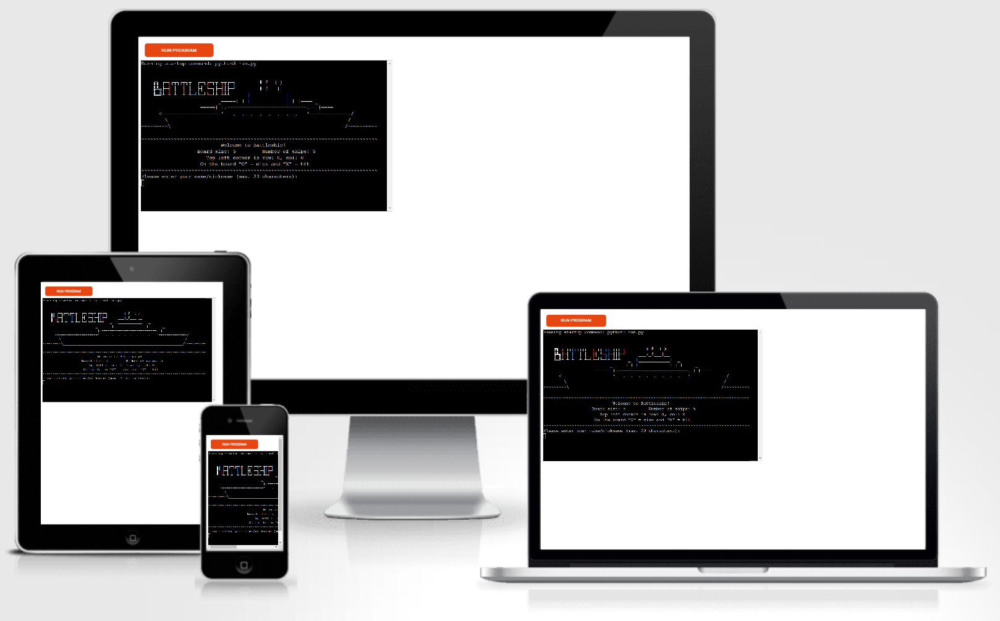

## How to play
Battleship is a single-player game based on the popular game of the same name, which dates back to World War I. For more information about the original Battleship game, please visit its [Wikipedia page here](https://en.wikipedia.org/wiki/Battleship_(game)).

To play Battleship, simply start by typing down your name or nickname and hitting enter. A board will be generated and displayed with ships placed randomly, which the player cannot see.

The game then asks the user to type in the row and column (known as coordinates) of the desired shot, with the top left corner having row and column 0 and 0, respectively.

If the shot was a "Hit" or "Miss", the respective message is displayed, and the board is updated with an "X" for a sunken ship or an "O" for a missed shot for the given coordinates. 

The objective is to sink all ships before the player runs out of turns (missiles).

## Features

### Existing Features

- __Logo__
    - At the top of the terminal screen, a Battleship image made by characters is displayed with the name of the game next to it.

    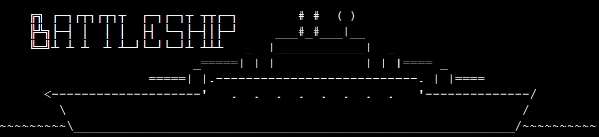

- __Welcome message__
    - Below the logo, a welcome message is displayed.
    - The game settings are displayed, which include board size, number of ships and number of turns.
    - An explanation of how to target the rows and columns.
    - How are the Hit or Miss shots are displayed on the board.
    - The game's objective.

    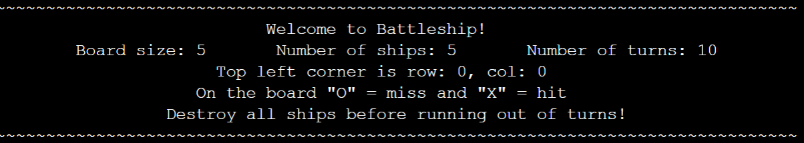

- __Player's name__
    - To better address the player and give personalized messages, the game asks the player to type in their name.

    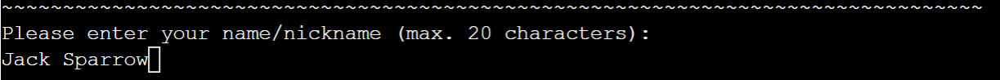

- __Game's statistics__
    - On every turn, the game's statistics (turns left, number of hits and ships remaining) are displayed so the player knows how they're doing.

    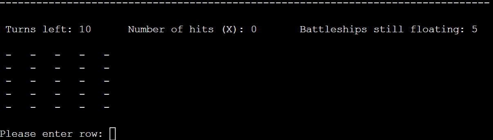

- __Feedback__
    - After every turn, a message will be displayed to let the player know if their shot hit or missed a ship.
    - The game statistics are updated and displayed.
    - The board is updated to show the respective character ("X" for hit, "O" for miss).
    - At the very top of the terminal screen, the player can see their last shot coordinates.

    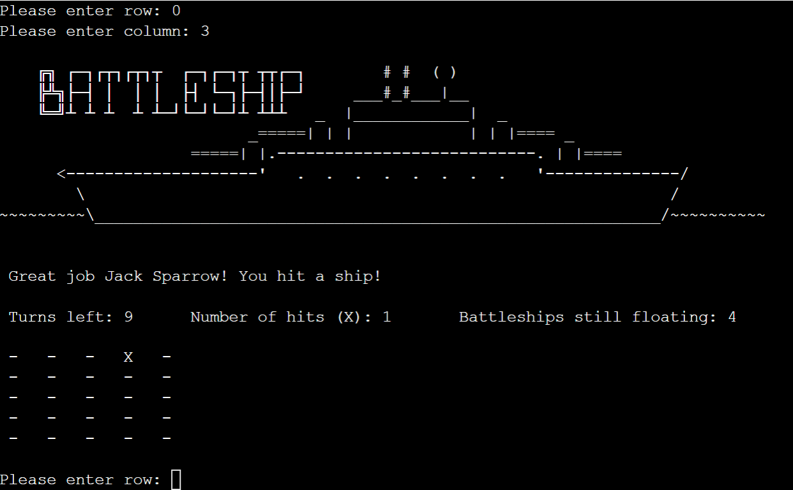

- __Input validation and error-checking__
    - For an improved user experience, all inputs are validated:
        - The player's name/nickname must have a length between 1 and 20 characters.
        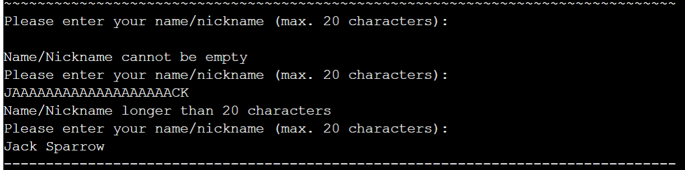
        
        - The row and column must be integers that are inside the board.
        - The game asks the player for new coordinates when guessing the same location twice.
        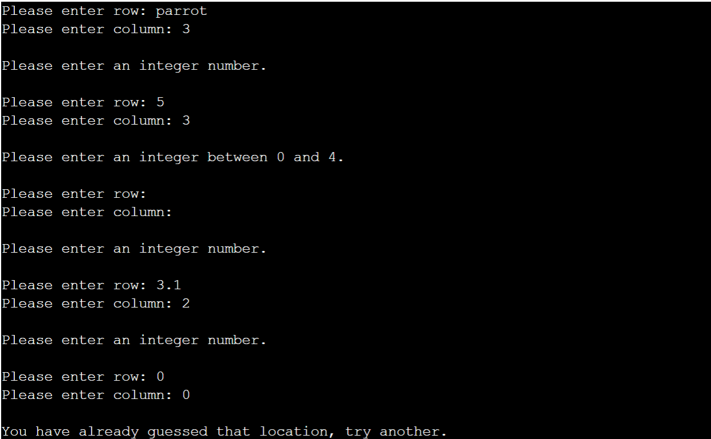

- __Game Result__
    - Battleship will congratulate the player if all ships are destroyed:
    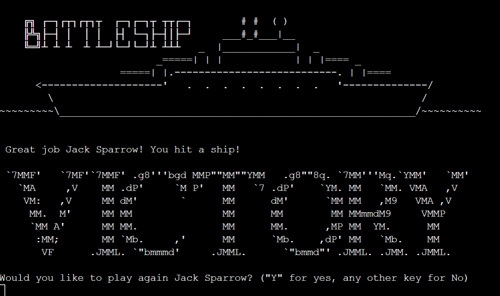

    - Battleship will let the player know when they run out of turns and ships are still floating:
    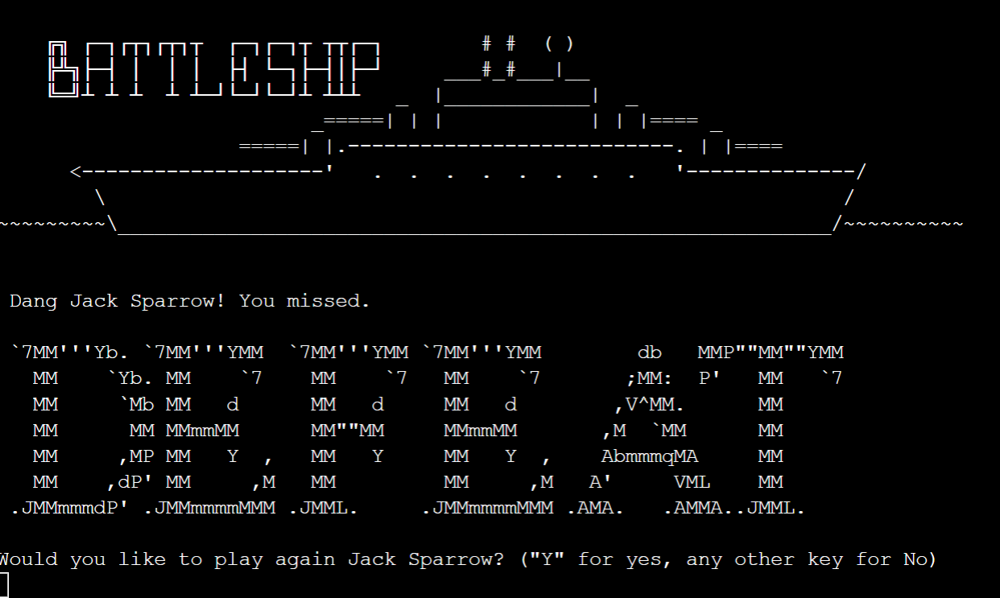

    - After the game's result, Battlefield asks the player if they would like to play again.

### Features Left to Implement

- __Ships with lengths larger than 1__
- __Play against a computer__
- __Change board size and number of ships__

## Technologies used

### Languages
- __Python__ - Used to write the game code.

### Python libraries
-   [random](https://docs.python.org/3/library/random.html) - Used for generating random numbers which are used to place ships on the board.
-   [os](https://docs.python.org/3/library/os.html) - Enables the use of clear screen commands in different operating systems.
-   [time](https://docs.python.org/3/library/time.html) - Used for delaying print statements and clearing screens commands.

## Testing
The game was tested on a local terminal as well as the Code Institute Heroku terminal and no errors were found.

### Easy mode (assessor mode)
If the player (or the assessor) would like to beat the game without guessing the ship's location, simply insert the following code line between lines 172 and 173:

    print(f"\nShips coordinates (for testing): {player_board.ships}")

### Validator testing
The code was passed through the Code Institute's PEP8 Python Linter with no errors found.
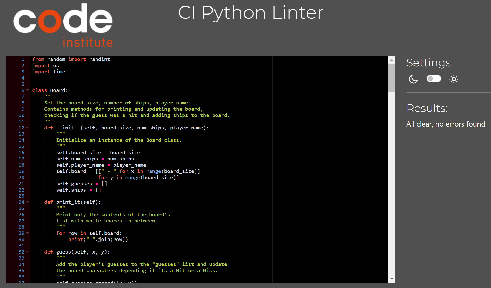

### Manual testing
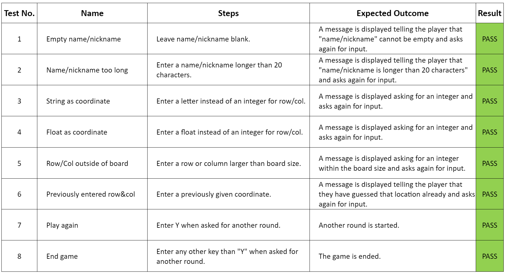

### Bugs
The game was crashing because I forgot to convert the given coordinates by the player to integers. This was solved by converting the strings to integers.

### Unfixed bugs
No Bugs were left unfixed.

## Deployment
GitHub and Heroku were used to deploy Battleship:

1. Fork or clone the [github.com/85rhrl/PP3](https://github.com/85rhrl/PP3) repository.
2. Create a new [Heroku](https://www.heroku.com/) app.
3. From the _Settings_ tab in Heroku:
    - Add the `heroku/python` and `heroku/nodejs` buildpacks.
    - Create a _Config Var_ called `PORT` and set it to `8000`.
4. Connect the Heroku app to the repository from Step 1.
5. Click on _Deploy_

## Credits
The Python code is based on the Portfolio Project Scope (ULTIMATE Battleships) video from Code Institute.

The code for clearing the terminal screen is based on an article on the [codingninjas](https://www.codingninjas.com/studio/library/how-to-clear-a-screen-in-python) website.

The ascii art for the Battleship image, Battleship title, and Victory and Defeat messages was taken from the [ascii.co.uk](https://ascii.co.uk/art/battleship) website.

### Acknowledgements

I would like to express my gratitude to the following people:

- Jubril Akolade for mentoring me, giving me guidance and encouragement.
- Kay Welfare for their continuous help and encouragement.
- My fellow classmates for their support and feedback.